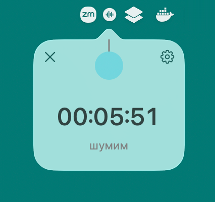

# noiser

A macOS menu bar noise generator (white / pink / brown) with a timer you set by
pulling a ball: the further you drag it, the longer it runs. When the time is up
the noise fades out and "time is up" is announced.



## Install

Requires [uv](https://docs.astral.sh/uv/) and macOS. No clone needed — uv fetches
the repo, resolves the dependencies into an isolated environment and puts a
`noiser` shim on your `$PATH`:

```sh
uv tool install git+https://github.com/elisey/noiser
noiser &
```

The shim lands in `~/.local/bin` (run `uv tool update-shell` once if that is not
on your `$PATH`). Later:

```sh
uv tool upgrade noiser     # pull a newer version
uv tool uninstall noiser   # remove it
```

To try it without installing anything, run the script straight from the repo —
its PEP 723 header tells uv what to install:

```sh
uv run https://raw.githubusercontent.com/elisey/noiser/main/noiser.py
```

## Usage

Click the menu bar icon to open the panel:

- **drag the ball** and release — start with that duration; you can drag in any
  direction and beyond the panel's edges;
- **click the ball** without dragging — run with no timer;
- **click the panel** — pause / resume;
- **⚙** — settings: noise type, volume, ball color, whether to announce "time is up";
- **✕** — quit.

Settings are stored in `~/.config/noiser/settings.json`.
